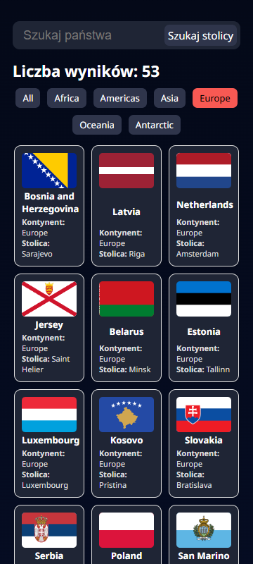
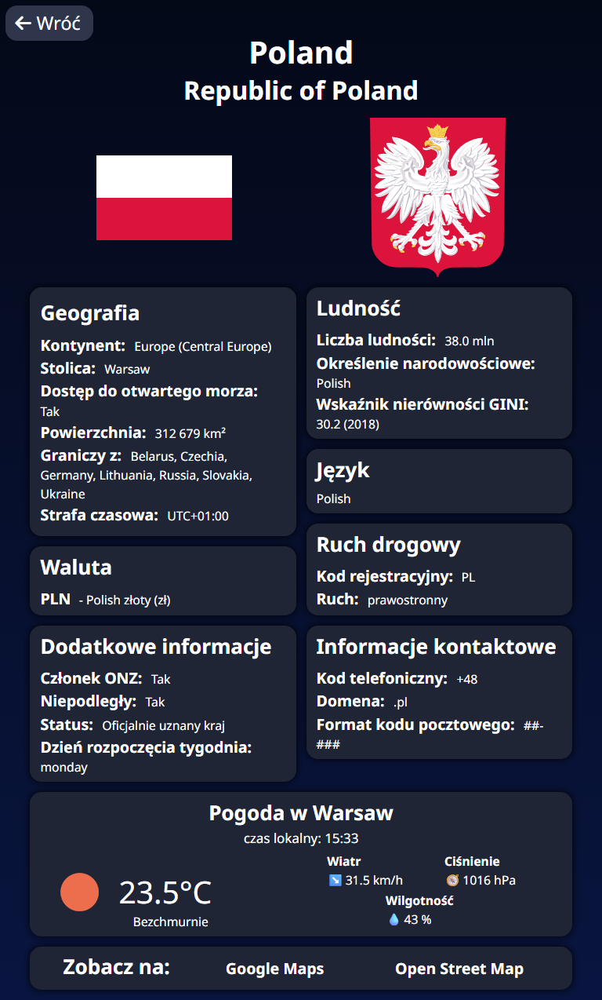
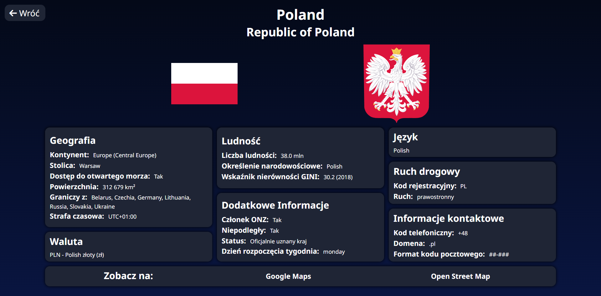

# 🌍 Country Explorer App

Aplikacja React, która pobiera dane o krajach z publicznego API [REST Countries](https://restcountries.com) i wyświetla je w przejrzystej formie. Pozwala na filtrowanie, wyszukiwanie i sprawdzanie szczegółowych informacji o każdym kraju.

## 🔗 Demo

👉 [Zobacz na żywo](https://dawidkuczma-dev.github.io/react-rest-countries/)

## 📸 Screenshots

<p align="center">
  
  
  
</p>


## ⚙️ Technologie

- React + Vite
- React Router
- CSS (grid, flexbox, media queries)
- REST API (fetch)
- GitHub Pages (hostowanie)

## 📁 Struktura folderów

```bash
📁 Country Explorer App
├── 📁 public
|   ├── index.html
|   ├── favicon.png
|   └── 📁 screenshots
├── 📁 src
|   ├── 📁 components
|   │   ├── 📁 CountryCard
|   │   |   ├── CountryCard.css
|   │   |   └── CountryCard.jsx
|   │   ├── 📁 Filters
|   │   |   ├── Filters.css
|   │   |   └── Filters.jsx
|   │   └── 📁 SearchBar
|   │       ├── SearchBar.css
|   │       └── SearchBar.jsx
|   ├── 📁 pages
|   │   ├── 📁 CountryDetails
|   │   |   ├── CountryDetails.css
|   │   |   └── CountryDetails.jsx
|   │   └── 📁 Home
|   │       ├── Home.css
|   │       └── Home.jsx
|   ├── App.jsx
|   ├── index.css
|   ├── main.jsx
|   └── reset.css
├── index.html
├── README.md
└── ... 

📁 components – komponenty wielokrotnego użytku 
📁 pages – głowne widoki (strony) 
🗒️ App.jsx – głowny komponent aplikacji  
🗒️ main.jsx – punkt wejściowy aplikacji

```

## ✨ Funkcje

- Wyszukiwanie państw po nazwie lub stolicy
- Filtrowanie państw według kontynentu
- Podgląd szczegółów każdego państwa
- Link do map Google i OpenStreetMap
- Responsywny interfejs (mobile/tablet/desktop)
- Obsługa przypadków braku danych

## 🧠 Czego się nauczyłem

- Korzystanie z Vite do tworzenia nowoczesnych aplikacji React
- Pracy z REST API (REST Countries) – pobieranie, filtrowanie i przetwarzanie danych
- Tworzenia wielu komponentów i zarządzania stanem aplikacji
- Używania React Router do obsługi nawigacji i dynamicznych ścieżek
- Stylowania komponentów z wykorzystaniem CSS (Grid, Flexbox, Media Queries)
- Obsługi przypadków brzegowych (np. brak stolicy, brak granic, brak waluty)

## 🚀 Uruchomienie lokalne

1. Sklonuj repozytorium  
```bash
git clone https://github.com/DawidKuczma-dev/react-rest-countries.git
cd react-rest-countries
npm install
npm run dev
```

## 📇 Autor

Dawid Kuczma  
[LinkedIn](https://www.linkedin.com/in/dawid-kuczma-a60836369/) • [GitHub](https://github.com/DawidKuczma-dev)

## 📝 Licencja

Ten projekt jest dostępny na zasadach licencji MIT.


